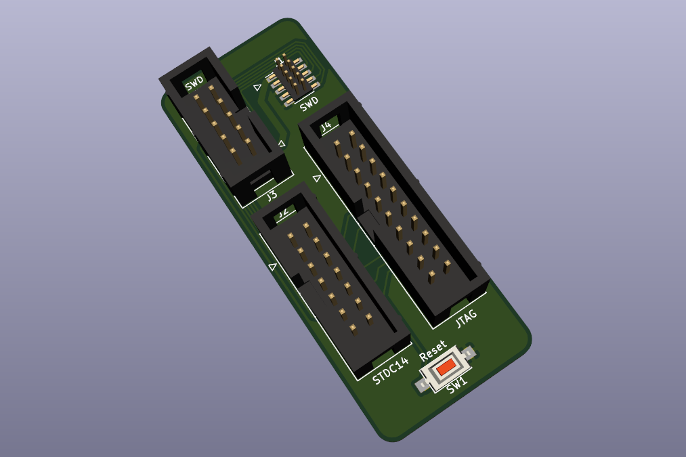

# SWD Multi Adapter

A handy embedded debugging interface adapter.

This simple board allows you to easily convert your SWD programming/debugging cables between:

- STDC14 - 14-pin connector commonly used in ST-Link debuggers and larger STM32-based boards
- ARM/JTAG - "legacy" 20 pin JTAG/SWD connector
- 0.05" 10-pin SWD - compact debugging/programming port
- 0.1" 10-pin SWD - DIY-friendly version of the above

Board designed in KiCad 5.1.6

Schematic: [PDF](docs/swd-multi-adapter.pdf)

License: [CC BY-SA 4.0](https://creativecommons.org/licenses/by-sa/4.0/)
